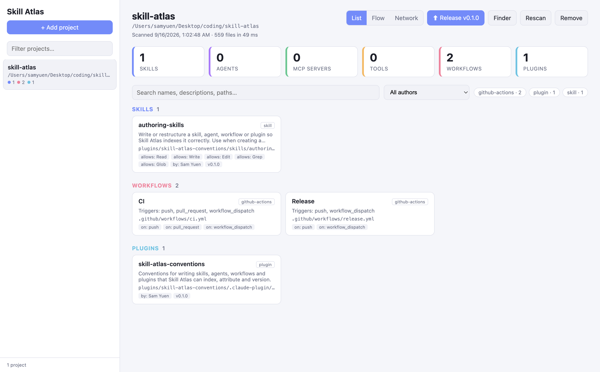
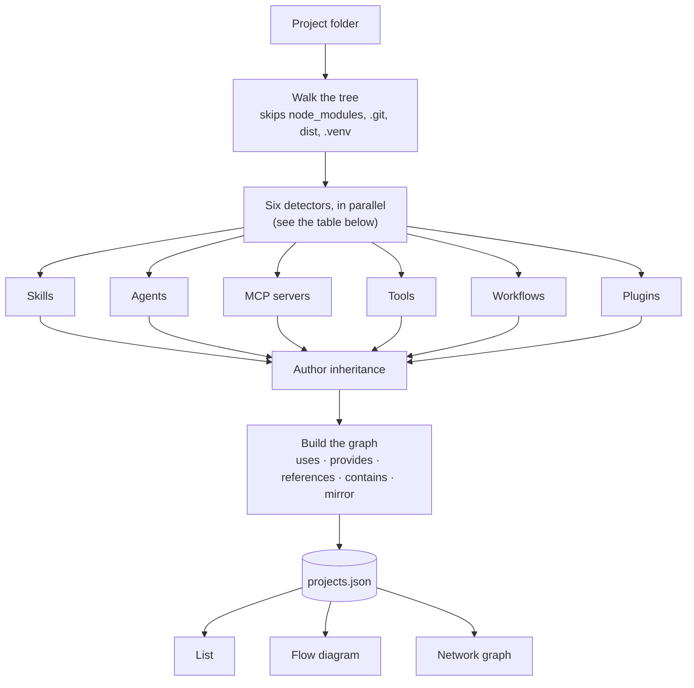
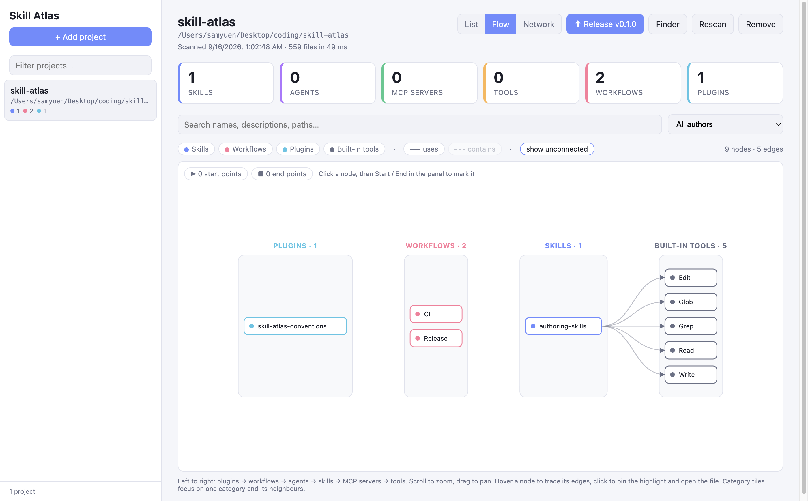
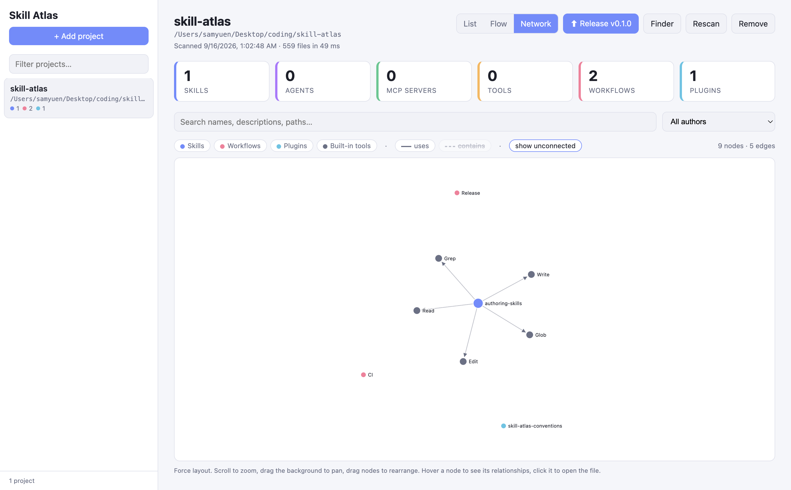

# Skill Atlas

[](https://github.com/SamYuen101234/skill-atlas/actions/workflows/ci.yml)
[](https://github.com/SamYuen101234/skill-atlas/actions/workflows/release.yml)
[](LICENSE)

A Mac app (also runnable in a browser): add project folders, scan them, and browse
everything AI‑agent related that they contain — skills, agents, MCP servers, tools,
workflows and plugins — as a list, a layered flow diagram or a relationship graph.



*The list view, scanning this repo itself — one tile per category, a search box and
author filter, and a card for every skill, workflow and plugin found. Click a card to read
the file and its metadata.*

It also **cuts plugin releases for you**. Pick a bump and it writes the new version to
`plugin.json`, the marketplace listing, the `metadata.version` of every skill and agent in
the plugin, the package manifests and the `CHANGELOG.md`, then optionally commits and tags
the result — so those six places cannot drift apart. See
[Plugin versioning](#plugin-versioning).

And it is **built for sharing work across a team**. Every skill, agent and tool carries an
`author`, inherited from the plugin that contains it so nobody has to annotate each file.
One dropdown then filters the list and both graphs by person: who owns this skill, what a
teammate has contributed, and — via `No author` — what is unattributed and therefore
unmaintained. See [Filtering by author](#filtering-by-author).

Everything runs locally; nothing is uploaded anywhere.

## Contents

- [Install](#install)
- [How it works](#how-it-works)
- [What it finds](#what-it-finds)
  - [Making your own workflow discoverable](#making-your-own-workflow-discoverable)
- [Scanning the global `~/.claude` folder](#scanning-the-global-claude-folder)
- [Build from source](#build-from-source)
- [Run in a browser](#run-in-a-browser)
- [Relationship graph](#relationship-graph)
- [Filtering by author](#filtering-by-author)
  - [How to define an author](#how-to-define-an-author)
  - [What gets an author without you writing one](#what-gets-an-author-without-you-writing-one)
  - [Keep the spelling identical](#keep-the-spelling-identical)
- [Conventions plugin](#conventions-plugin)
- [Plugin versioning](#plugin-versioning)
  - [Skills and agents are versioned through their plugin](#skills-and-agents-are-versioned-through-their-plugin)
  - [Where the version lives](#where-the-version-lives)
  - [How to cut a release](#how-to-cut-a-release)
  - [Keeping track](#keeping-track)
  - [Git, and pushing](#git-and-pushing)
  - [Automating it](#automating-it)
- [Tests](#tests)
- [Releasing a new version](#releasing-a-new-version)
- [API](#api)
- [Contributing](#contributing)
- [Author](#author)

## Install

Download the `.dmg` for your Mac from the [latest release](https://github.com/SamYuen101234/skill-atlas/releases/latest)
— `arm64` for Apple Silicon, `x64` for Intel — open it and drag **Skill Atlas** to Applications.

The build is **not signed with an Apple Developer ID**, so Gatekeeper blocks the first
launch. To open it:

- **Right-click** (or Control-click) the app in Applications → **Open** → **Open** in the dialog. Once only.
- If macOS says the app is "damaged" (the quarantine flag on a downloaded unsigned app), clear it:

  ```bash
  xattr -dr com.apple.quarantine "/Applications/Skill Atlas.app"
  ```

See [SIGNING.md](SIGNING.md) for how to produce a signed and notarized build that opens
with a normal double-click.

## How it works



The scan is read-only and entirely local: it reads files, resolves references between
them, and writes one JSON file. Nothing leaves the machine.

## What it finds

| Category  | Detected from |
|-----------|---------------|
| Skills    | `SKILL.md` files (Agent Skills spec), `.claude/commands/**/*.md` slash commands, `.cursor/rules/*.mdc` |
| Agents    | Markdown files in `.claude/agents/`, `agents/`, `.agents/`, `.github/agents/`, `.cursor/agents/` (frontmatter: name, description, model, tools); a root `AGENTS.md` (the cross-tool convention used by Codex, Cursor, Aider and others) |
| MCP       | `.mcp.json`, `.claude/settings*.json`, `.cursor/mcp.json`, `.vscode/mcp.json`, `.gemini/settings.json`, `.claude-plugin/plugin.json`, `mcp.json`, `claude_desktop_config.json`, `~/.claude.json` (user-scope servers) |
| Tools     | Tool definitions in source: MCP TS SDK `server.tool(...)`, Python `@mcp.tool` / `@tool`, LangChain `Tool(name=...)`, Anthropic/OpenAI tool schemas, Vercel AI SDK `tool({...})`, Go `mcp.NewTool`, Rust `#[tool]`; plus Claude Code permission rules and hooks in `.claude/settings*.json` |
| Workflows | `WORKFLOW.md` or `workflow.yaml`/`workflow.json` manifests, script-workflow folders (see below), GitHub Actions, GitLab CI, `workflows/` folders (YAML, JSON, n8n exports), Prefect `@flow`, Airflow `@dag`, Temporal `@workflow.defn` |
| Plugins   | `.claude-plugin/plugin.json`; a `marketplace.json` listing that points at a plugin folder in the project is merged into that plugin (shown as `listedIn`), other listings appear on their own |

### Making your own workflow discoverable

Two ways, in order of preference:

1. **Add a `WORKFLOW.md` manifest** to the workflow folder. It mirrors `SKILL.md`: YAML frontmatter plus an optional markdown body.

   ```markdown
   ---
   name: prompt-tuning-loop
   description: Tune AutoQM prompts, rerun the batch eval, and build the comparison workbook.
   entrypoint: run_test_pipeline.sh
   steps:
     - ingest: merge per-tenant CSVs into staging Snowflake
     - batch: run transcripts through the AutoQM endpoint
     - eval: score results with the eval model
     - report: build the old-vs-new comparison workbook
   inputs: [company_info.json, config/autoqm_config.json]
   outputs: [test_runs/<run>/summary.json]
   skills: [multi-tenant-batch-eval, build-comparison-workbook]
   agents: [aq-eval-planner]
   ---
   # Prompt tuning loop
   Free-form notes go here.
   ```

   Only `name` and `description` matter for display; the rest is shown as metadata. A `workflow.yaml` / `workflow.json` with `name`, `description`, `entrypoint` and `steps` works the same way.

2. **Rely on the heuristic.** A folder is reported as a `script-workflow` when its name (or the runner's name) contains *workflow*, *pipeline* or *orchestrat*, and it contains a runner script: `run*.sh`, `run*.py`, `main.py`, `pipeline.py`, `workflow.py`, `Makefile`, `Justfile` or `Taskfile.yml`. The description comes from the runner's leading comment block or the folder's README; subfolders with code are listed as stages and `VAR="${VAR:-default}"` lines are listed as env vars.

Folders such as `node_modules`, `.git`, `dist`, `.venv` are skipped.

## Scanning the global `~/.claude` folder

Not everything lives in a project. Skills you wrote for yourself, agents you reuse
everywhere, marketplace plugins you installed and user-scope MCP servers all sit in
`~/.claude` and apply to every repo you open. **Global** in the sidebar (⌘G in the app,
`POST /api/global`) scans that folder and adds it to the list as an entry named *Global
config*, marked with a `global` badge. It behaves like any other project: same categories,
same graph, same search, same Rescan.

What it covers:

| Found | Where |
|-------|-------|
| Skills | `~/.claude/skills/*/SKILL.md` |
| Commands | `~/.claude/commands/**/*.md` |
| Agents | `~/.claude/agents/*.md` |
| Plugins | `~/.claude/plugins/repos/**/.claude-plugin/plugin.json`, and everything inside them |
| MCP servers | `~/.claude/settings.json` and `~/.claude.json` |
| Permissions and hooks | `~/.claude/settings*.json` |

Claude Code's own runtime state — `projects/` (transcripts), `sessions/`,
`shell-snapshots/`, `statsig/`, `todos/`, `file-history/`, `backups/` and the rest — is
skipped: it is not authored content and transcripts alone can run to tens of thousands of
files. Nothing else in your home directory is read, and the file viewer will not open a
path outside the config folder even though the entry is rooted at `$HOME`.

Set `CLAUDE_CONFIG_DIR` and the scan follows it. The **Release** action is hidden for the
global entry — the plugins in there are installed copies, not plugins you publish.

## Build from source

Requires Node 20+.

```bash
npm install
npm run app        # launch the Mac app from source
npm run pack       # unpacked .app in release/mac-arm64/ (fast, for testing)
npm run dist       # release/Skill Atlas-<version>-<arch>.dmg + .zip
```

Working on this repo with a coding agent? [CLAUDE.md](CLAUDE.md) holds the project
conventions, and the [conventions plugin](#conventions-plugin) carries the authoring rules.

The app runs the same local server on a random loopback port and shows the UI in a native window with a menu: **File → Add Project** (⌘O), **Rescan** (⌘R), **Release Plugin** (⇧⌘R), **View → List / Flow / Network** (⌘1 / ⌘2 / ⌘3), **Search** (⌘F). Folder picking and "Open" / "Finder" use native dialogs. Project data lives in `~/Library/Application Support/Skill Atlas/data/projects.json`; the first launch from a source checkout copies the browser-mode list from `./data/` if present.

The `.dmg` is unsigned unless you add Apple signing credentials to the build; see [SIGNING.md](SIGNING.md).
Pushing a `v*` tag runs `.github/workflows/release.yml`, which builds both architectures and
attaches them to a GitHub Release (signed and notarized if the Apple secrets are configured).

## Run in a browser

```bash
npm start
```

Open <http://localhost:3210>. Set `PORT` to use a different port. The server binds to `127.0.0.1` only and refuses requests that are not addressed to localhost, because the API can read any file under the projects you add and run git in them. See [SECURITY.md](SECURITY.md).

Click **+ Add project**, paste a path (`~` is expanded) or use **Browse…** to pick a folder with the native macOS dialog. The project is scanned immediately. Use **Rescan** after changing files. Click any card to see the file contents and its metadata; **Open** launches it in the default app.

Projects and their last scan are stored in `data/projects.json`.

## Relationship graph

Two graph views are available from the toggle at the top right of a project:

- **Flow** (recommended): a layered left-to-right diagram with one column per category, in the order plugins → workflows → agents → skills → MCP servers → tools → built-in tools. Edges flow between columns; same-column references arc on the right. Node order within a column is chosen to reduce crossings. Hover a node to trace its edges, click to pin the highlight and open the file, click the background to unpin.
- **Network**: a force-directed layout of the same data, useful for spotting clusters.



*The flow diagram of this repo — the `authoring-skills` skill wired to the built-in tools
it is allowed to use, with the plugin and CI/release workflows shown as unconnected nodes.*



*The same data as a force-directed network.*

**Start and end points.** The flow view fills marked nodes solid with their category colour (a marked skill is solid blue, an agent solid purple, …); start points get a ▶ before the name and end points a ■ after it. The counters at the top left of the canvas highlight each group. Roles are marked explicitly: open a node and press **Start** or **End** in the detail panel (stored per project in `data/projects.json`), or declare `role: start` / `role: end` in a skill or agent's frontmatter. There is no automatic detection, because cross-references between skills and agents are often bidirectional and make in/out degree a poor signal.

**Author filter.** The toolbar's author dropdown filters both graph views as well as the list — see [Filtering by author](#filtering-by-author).

In both views: scroll to zoom, drag the background to pan, legend chips toggle categories and edge types, the category tiles focus the graph on one category plus its direct neighbours, and the search box highlights matching nodes.

Edges are derived during the scan:

| Edge | Meaning |
|------|---------|
| uses | Declared in frontmatter: agent `tools`, skill `allowed-tools`, workflow manifest `skills` / `agents` / `tools`. Built-in Claude Code tools (Read, Bash, …) appear as grey nodes. |
| provides | A tool is defined in the MCP server's source tree (resolved from the server's command/args, or a folder named after the server). |
| references | A skill, agent or workflow document mentions another item by name or folder. |
| contains | The item lives inside a plugin's folder. |
| mirror | Same name and category at two paths, e.g. a plugin copy. Hidden by default. |

Unconnected nodes (typically permission rules) are hidden by default; toggle **show unconnected** in the legend.

## Filtering by author

**Author is the only metadata filter.** Alongside the search box and the category/kind
chips, the toolbar has one dropdown, and it filters by author — there is no filtering by
version, model, licence or any other field. Picking an author narrows the list, the kind
chips and both graph views at once. `All authors` clears it, and `No author` shows exactly
the items that have none, which is the quickest way to find what still needs attributing.

**It earns its keep on a shared repo.** Alone, you know who wrote what. With five people
adding skills and agents to the same project — or publishing a plugin marketplace between
them — the author field is what turns a growing pile of Markdown into something you can ask
questions of:

- *Who owns this?* Open a skill that is misbehaving and the detail panel names the person to
  ask, instead of you guessing from `git log` on a file that has been moved twice.
- *What did they add?* Filter to a teammate to review everything they contributed across
  every category at once, in the list and in both graph views.
- *What is unowned?* `No author` is the gap list. An unattributed skill is one nobody has
  agreed to maintain, and it is much cheaper to notice that now than when it breaks.

Because authors are inherited, a team does not have to annotate every file. Declare the
author once in the plugin's `plugin.json` and everything inside it is attributed, then let
individuals override it on the specific skills and agents they own. Agreeing on the format
up front matters more than it looks — see
[Keep the spelling identical](#keep-the-spelling-identical).

### How to define an author

Declare it in frontmatter or a manifest, depending on the item:

| Item | Where you write it |
|------|--------------------|
| Skill (`SKILL.md`) | `author:` at the top level, or `metadata.author` |
| Agent (`.md` under an agents folder) | `author:` at the top level, or `metadata.author` |
| Workflow (`WORKFLOW.md`, `workflow.yaml`/`.json`) | `author:` at the top level, or `metadata.author` |
| Plugin (`.claude-plugin/plugin.json`) | `"author"` — a string, or `{ "name": ..., "email": ... }` |
| Marketplace listing (`marketplace.json`) | the entry's `author`, falling back to the file's `owner` |

```markdown
---
name: my-skill
description: What it does.
metadata:
  author: Ada Lovelace
  email: ada@example.com
---
```

An object form works too, and produces the same `Ada Lovelace <ada@example.com>`:

```yaml
author:
  name: Ada Lovelace
  email: ada@example.com
```

### What gets an author without you writing one

Two kinds of item never declare an author directly and are filled in during the scan:

- **MCP servers** take the author from a `pyproject.toml` or `package.json` in their own
  folder — found by resolving the `command` / `args` in `.mcp.json` — and then pass it on to
  the tools defined in that tree. Both PEP 621 (`authors = [{ name = "...", email = "..." }]`)
  and Poetry (`authors = ["Name <email>"]`) are read.
- **Anything inside a plugin folder** with no author of its own inherits the plugin's.

Inheritance never overwrites a declared author, and permission rules and hooks are left out
of it. When an author was inherited, the detail panel names the source — `plugin my-plugin`,
`MCP server github`, or `package manifest` — so an unexpected attribution is traceable.

Slash commands and cursor rules have no author field of their own; they only get one by
sitting inside a plugin folder.

### Keep the spelling identical

The dropdown groups by the **exact** author string, and only strips the `<email>` part for
display. So `Ada Lovelace` and `Ada Lovelace <ada@example.com>` are two separate entries
that both read "Ada Lovelace" in the menu, and picking one hides the other's items. Pick one
form per person and stay with it — the surest way is to declare the author once on the
plugin and let everything inside inherit it.

## Conventions plugin

Skill Atlas finds things by convention, so it ships those conventions as an installable
Claude Code plugin rather than leaving you to copy a file. This repository is also a plugin
marketplace. Run both commands in an interactive Claude Code session — they are two separate
steps:

```
/plugin marketplace add SamYuen101234/skill-atlas
```

Clones this repo into `~/.claude/plugins/marketplaces/skill-atlas/` and registers the
catalogue. It installs nothing on its own.

```
/plugin install skill-atlas-conventions@skill-atlas
```

Installs the plugin into `~/.claude/plugins/cache`. If the summary says
`Run /reload-plugins to activate.`, do that (or restart the session) before the skill is
live. The `@skill-atlas` suffix is the marketplace's `name`, which happens to match the repo
name here.

Your agent then has the `authoring-skills` skill in every project, and reaches for it when
you ask it to write a skill, add an agent, package something as a plugin, or work out why an
item is missing from a scan or showing **No author**. It covers the plugin layout, the
frontmatter each kind of item needs, author inheritance, graph roles, and the two mistakes
that quietly cost you attribution. Update it later with `/plugin update`.

The plugin lives in [plugins/skill-atlas-conventions](plugins/skill-atlas-conventions) and is
written to its own standard, so the scanner indexes it like any other — authored, versioned,
and released through the flow it documents.

## Plugin versioning

A plugin's version is scattered across several files that drift apart easily. Skill Atlas
treats `plugin.json` as the source of truth and writes the rest for you in one action.

### Skills and agents are versioned through their plugin

There is no per-skill release button, and that is deliberate: a lone `SKILL.md` has nowhere
to record a version that anything else agrees with. **Versioning follows
[Claude's plugin standard](https://docs.claude.com/en/docs/claude-code/plugins)** — the
**Version** action only appears on an item the scan identified as a plugin, meaning a folder
with a `.claude-plugin/plugin.json` manifest. Skills and agents are then versioned *with*
the plugin that contains them.

So if you want your own skills and agents versioned, package them as a plugin. The minimum:

```
my-plugin/
├── .claude-plugin/
│   └── plugin.json        { "name": "my-plugin", "version": "0.1.0" }
├── skills/
│   └── my-skill/
│       └── SKILL.md
└── agents/
    └── my-agent.md
```

Two things determine how much gets stamped:

- **Location.** Only files under the plugin folder are touched. A skill left outside it
  keeps whatever version it had. Agent files must sit under an `agents/` folder to be
  picked up.
- **A `metadata:` block.** Add one to each `SKILL.md` and agent you want stamped — the
  release writes `version` into it, adding the key if it is missing. Files without a
  `metadata:` block are skipped rather than rewritten.

  ```markdown
  ---
  name: my-skill
  description: What it does.
  metadata:
    version: 0.1.0
    author: Your Name
  ---
  ```

To publish the plugin to others, add a `marketplace.json` listing it; the release then keeps
that entry's version in step too. See Anthropic's
[plugins](https://docs.claude.com/en/docs/claude-code/plugins) and
[Agent Skills](https://docs.claude.com/en/docs/agents-and-tools/agent-skills) docs for the
full spec.

### Where the version lives

| Where | What it is | Updated by |
|-------|------------|------------|
| `<plugin>/.claude-plugin/plugin.json` → `version` | **The source of truth.** Everything else is derived from it. | Always |
| `marketplace.json` → the entry whose `name` matches the plugin | What people installing from your marketplace actually see | Always, when the plugin is listed in one |
| `metadata.version` in each `SKILL.md` and agent `.md` | Per-file stamp, so a skill copied out of the plugin still says where it came from | Checkbox, on by default |
| `pyproject.toml` / `package.json` inside the plugin folder | The packaging version, if the plugin ships code | Checkbox, on by default |
| `<plugin>/CHANGELOG.md` | The human history | Always — created if missing |
| Git tag `<plugin-name>-v<version>` | The immutable marker used to diff the next release | Checkbox, off by default |

Only files **inside the plugin folder** are touched, plus the `marketplace.json` that lists
it. A skill with no `metadata:` block is left alone rather than having one inserted.

### How to cut a release

1. Open the plugin's card and press **Version**, or use **File → Release Plugin…** (⇧⌘R).
   With several plugins in the project you get a picker first.
2. The dialog opens on the current state — see [Keeping track](#keeping-track) below for
   what it shows you.
3. Pick the bump. The resulting number is previewed next to each choice:

   | Bump | Use it for |
   |------|-----------|
   | **Patch** | wording tweaks, fixes |
   | **Minor** | a new skill, agent or tool |
   | **Major** | a breaking change to how a skill is called |
   | **Custom** | type an exact `1.2.3` — anything that is not semver is rejected before a single file is written |

4. Write the changelog entry. It is pre-filled with the skills and agents that changed
   since the last tag; leaving it empty records `- No notes.`
5. Tick what to write. The two version checkboxes are on by default, and greyed out when
   the plugin has nothing of that kind — no `metadata:` blocks, no package manifests.
   **Git commit** and **Git tag** are off by default, and unavailable outside a git repo.
6. Press **Write files**. The response lists every path written, and the project is
   rescanned immediately so the cards show the new version.

The new `CHANGELOG.md` section is prepended under the `# Changelog` heading, newest first:

```markdown
## 0.4.0 - 2026-09-16

- Added the deploy-service skill.
```

### Keeping track

The dialog is also the status view — open it just to look, and cancel:

- **Current** — the version in `plugin.json`, with the `marketplace.json` version beneath
  it. When they disagree you have found drift: a previous release that only half-applied.
- **Last tag** — the most recent `<plugin>-v*` tag, plus the current branch and how many
  files in the plugin folder are uncommitted. The tag is what "changed since" is measured
  against; it reads `none` for a plugin you have never tagged.
- **Changed since last release** — every file in the plugin folder touched since that tag,
  including uncommitted edits. An empty list means there is nothing to release; a long one
  usually means a bump is overdue.

Over time the git tags are the audit trail: `git tag --list '<plugin-name>-v*'` gives the
release history, and `git diff <plugin>-v0.3.0..<plugin>-v0.4.0 -- <plugin-dir>` shows
exactly what shipped between two of them.

### Git, and pushing

**The app never pushes.** With **Git commit** ticked it stages exactly the files it wrote
and commits them as `<plugin> v<version>`; with **Git tag** ticked it adds an annotated
`<plugin>-v<version>`. The result then shows the command to run yourself:

```bash
git push origin main <plugin-name>-v0.4.0
```

Outside a git repository the two options are greyed out in the dialog (and report
`Not a git repository` if you drive the API directly); the files are still written either way.

### Automating it

The same two operations are on the HTTP API, so a script can do the bump:

```bash
# inspect
curl "localhost:3210/api/projects/$ID/version?plugin=pkg/.claude-plugin/plugin.json&listedIn=.claude-plugin/marketplace.json"

# write
curl -X POST localhost:3210/api/projects/$ID/version \
  -H 'content-type: application/json' \
  -d '{"pluginPath":"pkg/.claude-plugin/plugin.json",
       "listedIn":".claude-plugin/marketplace.json",
       "version":"0.4.0",
       "changelog":"- Added the deploy-service skill.",
       "updateFileVersions":true,
       "updateManifests":true,
       "commit":false,
       "tag":false}'
```

> This versions **a plugin the app found in one of your projects**. For releasing Skill
> Atlas itself, see [Releasing a new version](#releasing-a-new-version).

## Tests

```bash
npm test                          # node --test, no extra dependencies
node --test test/scanner.test.js  # one file
```

The suite uses the built-in Node test runner and runs in well under a second. Each test
builds a throwaway project tree in a temp directory (see [test/helpers.js](test/helpers.js))
and asserts against a real scan, so there is nothing to keep in sync with fixtures
checked into the repo.

| File | Covers |
|------|--------|
| [test/scanner.test.js](test/scanner.test.js) | Every detector (skills, slash commands, cursor rules, agents, MCP servers, tools, workflows, plugins), the graph edges between them, author resolution and inheritance, and the ignore rules |
| [test/versioning.test.js](test/versioning.test.js) | `nextVersion` semver maths, `versionInfo` reporting, and what `bumpVersion` writes — plugin.json, marketplace entry, frontmatter, manifests, CHANGELOG — plus its path-containment and semver guards |
| [test/server.test.js](test/server.test.js) | The HTTP API end to end against a real server on a random loopback port: add / rescan / rename / delete, persistence, and the file endpoint's refusal to read outside the project |

[CI](.github/workflows/ci.yml) runs them on macOS and Linux against Node 20 and 22, and
a release build will not start unless they pass.

## Releasing a new version

This is the app's own release process. (For versioning a *plugin you found with the app*,
see [Plugin versioning](#plugin-versioning) above — a different thing entirely.)

1. Make sure the working tree is clean, then bump the version:

   ```bash
   npm version patch     # 0.1.0 -> 0.1.1   (minor / major also work)
   ```

   That rewrites `package.json`, commits it, and creates a matching `v0.1.1` tag.

2. Push the commit and the tag:

   ```bash
   git push && git push --tags
   ```

3. The `v*` tag triggers [`.github/workflows/release.yml`](.github/workflows/release.yml),
   which builds `arm64` and `x64` on a macOS runner and attaches the `.dmg` and `.zip`
   files to a new GitHub Release. It signs and notarizes them when the Apple secrets from
   [SIGNING.md](SIGNING.md) are set on the repository, and ships unsigned builds otherwise.

To publish from your own Mac instead of CI:

```bash
npm run dist
gh release create v0.1.1 release/*.dmg --generate-notes
```

Version numbers follow semver: patch for fixes, minor for new detectors or views, major
for a change that invalidates an existing `projects.json`.

## API

| Method | Path | Purpose |
|--------|------|---------|
| GET    | `/api/projects` | List projects with counts |
| POST   | `/api/projects` `{path, name?}` | Add (or rescan an existing) project |
| POST   | `/api/global` | Add (or rescan) the global `~/.claude` config |
| GET    | `/api/projects/:id` | Full scan result |
| POST   | `/api/projects/:id/scan` | Rescan |
| PATCH  | `/api/projects/:id` `{name}` | Rename |
| DELETE | `/api/projects/:id` | Remove from list |
| GET    | `/api/projects/:id/file?path=` | Read a file inside the project |
| POST   | `/api/pick-folder` | Native folder picker (macOS) |

## Contributing

Bug reports, new scanner detectors and UI improvements are welcome. See
[CONTRIBUTING.md](CONTRIBUTING.md) for local setup and what's most useful to work on.

## Author

**Sam Yuen** — [@SamYuen101234](https://github.com/SamYuen101234)

Released under the [MIT License](LICENSE). Issues and pull requests are welcome at
[SamYuen101234/skill-atlas](https://github.com/SamYuen101234/skill-atlas) — see
[CONTRIBUTING.md](CONTRIBUTING.md) for how to get set up and what's useful to work on.
